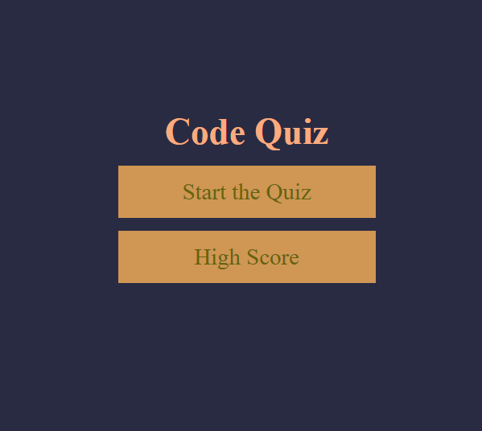
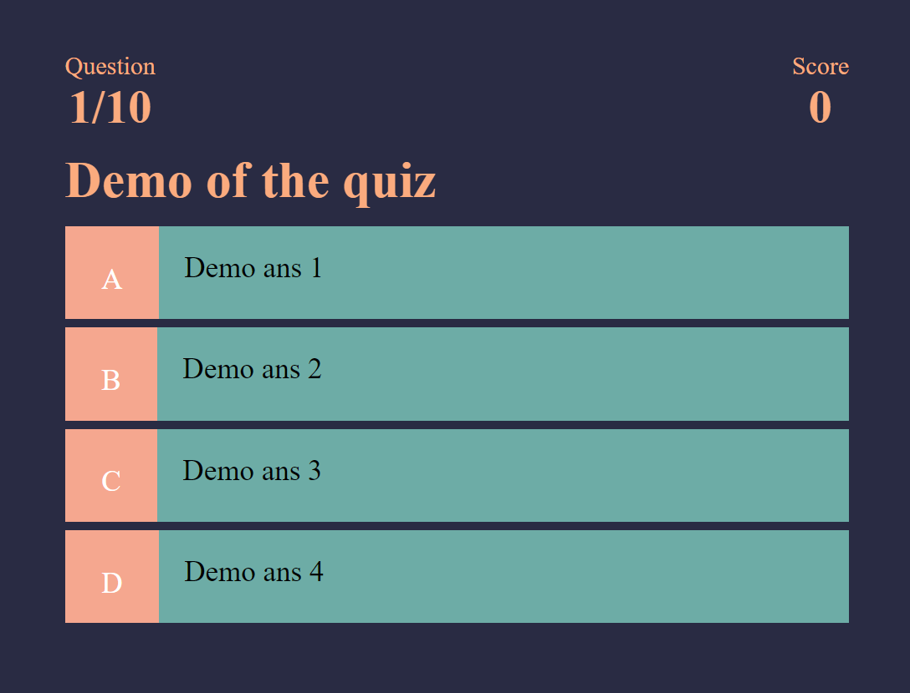

# "Code Quiz" Using HTML, CSS, and JavaScript

---

## Background of the App

I used only HTML,CSS, and JavaScript for this app. Some **highlights** of the app

* Dynamically generate HTML in JavaScript
* Screen reader friendly and meet the 508 compliance 
* ES6 Features - const, let, template literal, and Arrow function
* Featch Database API

## Here is demo quiz screen:

